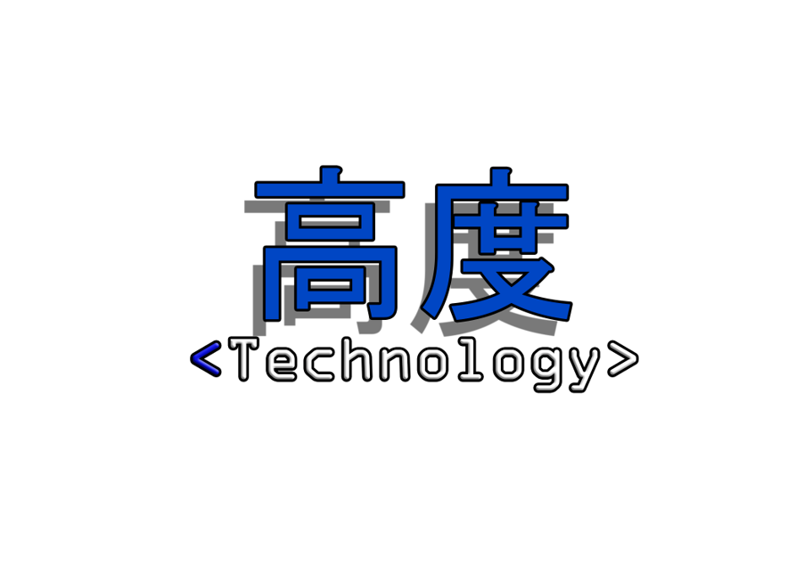
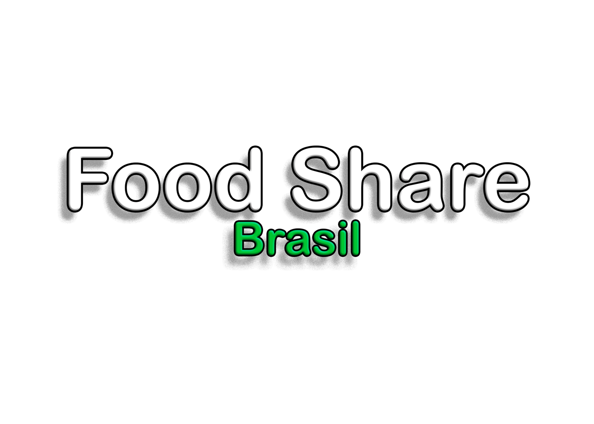
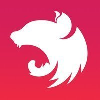
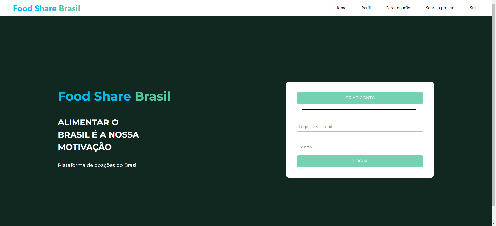
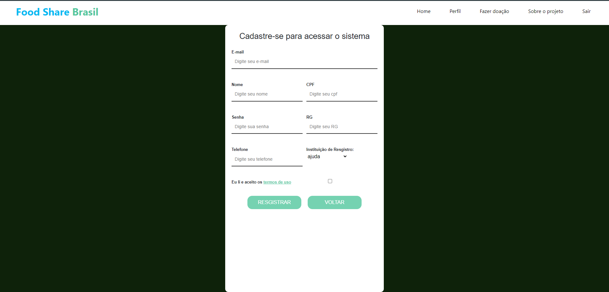
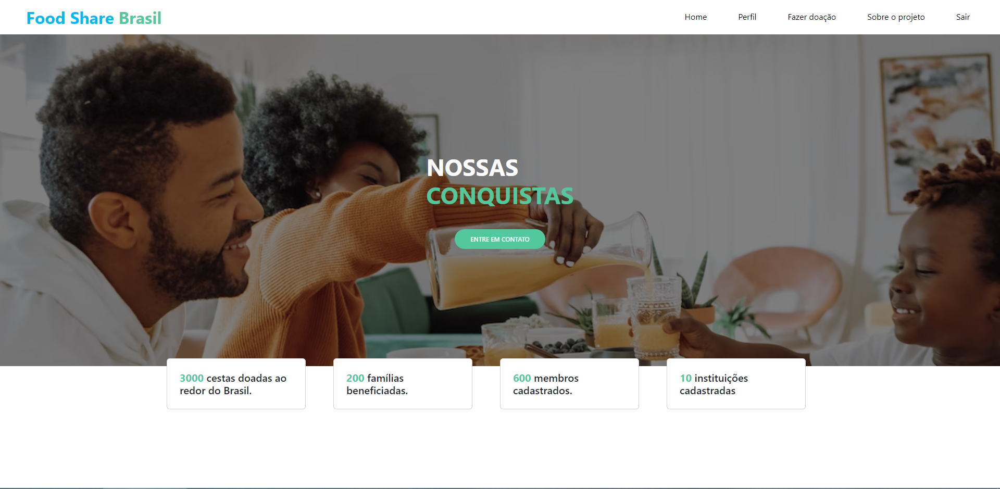
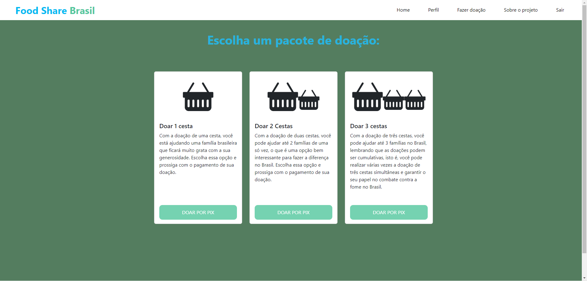
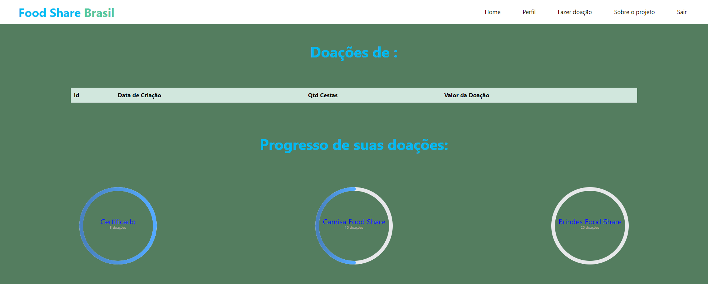
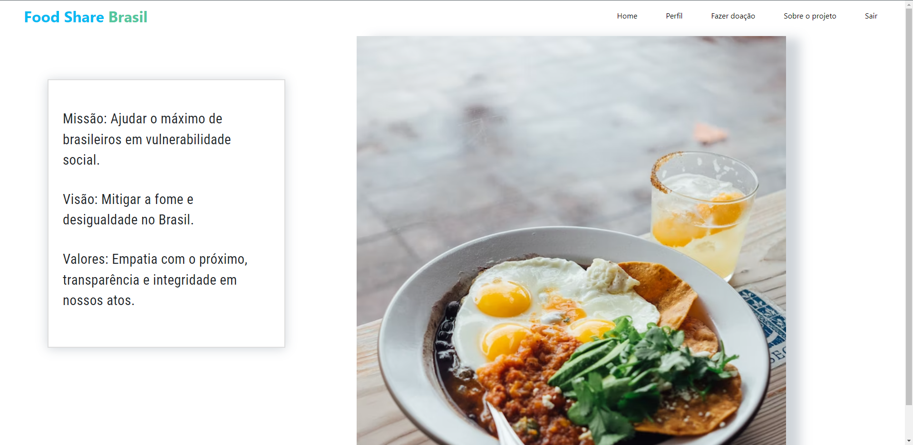

# Equipe Kodo Technology
  

# Projeto Food Share: Brasil
  

## __Sobre o projeto:__
O projeto Food Share: Brasil está sendo desenvolvido utilizando como inspiração o objetivo de desenvolvimento sustentável de número 2 <a href="https://www.ipea.gov.br/ods/ods2.html">"Fome zero e agricultura sustentável".</a> O intuito do projeto está pautado na meta 2.1 deste objetivo de desenvolvimento sustentável, que diz o seguinte:   
"Até 2030, erradicar a fome e garantir o acesso de todas as pessoas, em particular os pobres e pessoas em situações vulneráveis, incluindo crianças e idosos, a alimentos seguros, culturalmente adequados, saudáveis e suficientes durante todo o ano."

## __Tecnologias utilizadas__:
Para o desenvolvimento do projeto, nós utilizamos algumas das tecnologias mais versáteis e conhecidas na área de programação.  

    
    
    
    
    

 
 
<ul>
    <li>O Front-End do projeto foi desenvolvido em Angular na versão 14.2.10 (<a href="https://angular.io/docs">Acessar documentação</a>);</li>
    <li>O Back-End do projeto foi desenvolvido em NestJS na versão 9.0.0 (<a href="https://docs.nestjs.com/">Acessar documentação</a>);</li>
    <li>O banco de dados do projeto foi construído com o driver do MySQL (<a href="https://dev.mysql.com/doc/">Acessar documentação</a>);</li>
    <li>O Docker foi utilizado para que fosse possível criar um container o banco de dados pudesse ficar hospedado durante o desenvolvimento (<a href="https://docs.docker.com/">Acessar documentação</a>);</li>
    <li>O DBeaver foi utilizado como SGBD para que pudessemos realizar nossas consultas e demais operações com o banco de dados. (<a href="https://dbeaver.com/docs/wiki/">Acessar documentação</a>)</li>
</ul>

## __Telas do Projeto__:

### __Tela de Login:__

Esta é a tela de login do projeto Food Share: Brasil.  

  

### __Tela de Cadastro:__

Esta é a tela de cadastro do projeto Food Share: Brasil. Nela nossos doadores podem efetuar o cadastro e posteriormente acessar a plataforma.

 

### __Tela Home:__

Esta tela possui o intuito de apresentar os objetivos e metas do projeto Food Share: Brasil da perspectiva dos desenvolvedores (equipe Kodo Technology).

  

### __Tela de Doação:__

Nesta tela nossos doadores podem escolher qual será a opção de doação, podendo ser de uma, duas ou três cestas básicas que terão seus valores convertidos para dinheiro em reais, e então o doador poderá finalizar a doação pagando o valor no PIX.

  

### __Tela de Perfil:__

Nesta tela o doador pode consultar suas doações já realizadas e também o seu progresso como doador. Conforme o doador realiza suas doações, ele também estará participando de um processo gamificado para resgatar prêmios dentro da plataforma.
  
 

### __Tela Sobre o Projeto:__

Para acessar esta tela, o doador não irá precisar estar autenticado no sistema. O intuito dela é apresentar para nossos doadores nossa missão, visão e valores.  

 

# __Equipe__
Time Kodo Technology:  
Alex Scura  
Danilo Jesus  
Matheus Avilla  
Thiago Barbosa  
Email para contato: kodotechteam@gmail.com
